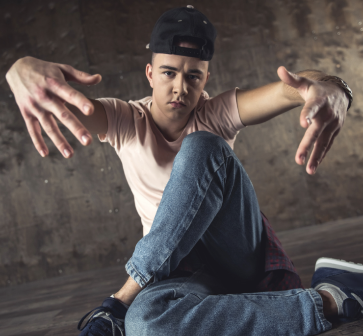

# BEM Notation and Object Oriented CSS

A project on how to write scaleable CSS using BEM notation and OOCSS

## What is BEM? 🧐

BEM notation is a CSS naming convention designed to keep CSS understandable and scaleable by avoiding naming conflicts and specificity wars. Creating CSS "Blocks" keeps code modular and re-usable, reducing the amount of code we have to write. Yay.

BEM stands for Block Element Modifier and has a high adoption rate amongst developers due to it's low cost, ease of use - and success!

Lets break it down...



## Block

A "Block" is a standalone entity that is meaningful on it's own.

Some "Block" examples might be: buttons, headers, containers, cards, list and input 


## Element 

An "Element" is part of a block. An element has no meaning on it's own.

For example, some "Elements" would be: button text, header title, list item, container card. 

Each element belongs to it's block parent. A header's title. A list's item etc. 

A double underscore __ means *inside* the block


## Modifier

A "Modifier" changes - or modifies 😉 - a block or elements appearance or behaviour.

For example, some "Modifiers" might be: disabled, on/off, size small, color red etc

Double hyphen -- signals a modifier.

------

Here are some examples in code:

```
/* Block component */

.button {}

/* Element that depends upon the block or is *inside* the block */

.button__text {}
.card__img {}

/* Modifier that changes the style of the block or element */

.button--disabled {} 
.button--small {}

/* Used together they might look something like this: */

.button__text--disabled {}
```

# What is OOCSS?

OOCSS (Object Oriented CSS) is a methodology for writing CSS that abstracts away CSS repetition into re-usable "objects". 

## What is a CSS "object"?

A CSS "object" is "...a repeating visual pattern, that can be abstracted into an independent snippet of HTML, CSS, and possibly JavaScript. That object can then be reused throughout a site" - [Object Oriented CSS](https://github.com/stubbornella/oocss/wiki)


There are two main principles of OOCSS that will help you write CSS that follows a more Object Oriented approach. 

These are:

## Separation of Structure from Skin

Separation of Structure from Skin means differentiating between repeatable, "invisible" patterns such as height, width, padding, margin, overflow etc from repeatable visible ones such as colours, fonts, shadows, gradients of an element.

For example, if we had three buttons that all looked the same apart from their colour, we would add the structure of the buttons (their height, width, border radius etc) into the button class. We would then create additional classes that can apply different "skins" (individual colours or styling) to the buttons and add these additional classes wherever needed.

Before OOCSS your code might look like this:

```
button--default {
  width: 7rem;
  padding: 5px; 
  border-radius: 4px;
  text-align: center;
  font-size: 1rem;
  background: green;
}

button--success {
  width: 7rem;
  padding: 5px; 
  border-radius: 4px;
  text-align: center;
  font-size: 1rem;
  background: green;
}

button--warning {
  width: 7rem;
  padding: 5px; 
  border-radius: 4px;
  text-align: center;
  font-size: 1rem;
  background: red;
}

```

Using OOCSS you can reduce your code to:


```
/* Structure */
.button {
  width: 7rem;
  padding: 5px; 
  border-radius: 4px;
  text-align: center;
  font-size: 1rem;
}

/* Skins */
.button--success {
  background: green;
}

.button--danger {
background: red;
}

```


The html:

```
  <button class="button">Default</button>
  <button class="button button--success">Success</button>
  <button class="button button--danger">Danger</button>

```

These buttons "inherit" their main styles from the button class and "extend" with their own individual styling. By doing this our repeated code is abstracted away into a repeatable button class, reducing repetition in our code. 


## Separation of Container and Content


## BEM in Practice 👩‍🎨

Now you understand what BEM is, it's time to put those sweet new learnings into practice!

After forking this repository you will need to then clone the repo locally and open up your index.html file in the browser.

Type 'open index.html' in your terminal and press enter (make sure you're in the right directory!). Your Star Wars / BEM wars page should open in your browser. Alternatively, right click on your index.html file and select 'open with..' then select the browser of your choice.

You should now see pictures of Darth Vader and Yoda on your screen. 

## The Challenge 🤺

The internet is being destroyed by unscaleable, unmanageable CSS! Specificity wars are everywhere, elements are lost in the deep dark depths of nesting and fleets of developers are fleeing in their droves! But!

Rebellions are built on hope, Skywalker... and a little more knowledge around BEM lights our way. 🕊

In your index.html file you must work with ~~Yoda~~ BEM to create a more manageable, more zen web page.

## The Rulez 😒

Your page should:

- Have two cards, one light coloured card for Yoda, The Force and BEM. One dark coloured card for Darth Vader and his CSS hell!

- Have some card styling like borders, padding, shadows etc

- Use BEM notation to clearly name and structure your CSS to target block, elements and modifiers on the page

* * Hint: avoid duplication in your code. Remember, your "block" styles will affect *all* cards whereas your modifier styles will change *specific*, or *individual* things, like the colour of your cards.

- NOT use Ids. This is because BEM recommends avoiding Ids and only using classes to avoid specificity wars (if everything is a class, everything has a specificity of 10 which is easy to remember, and easy to override). 

- Try not to select elements using their tag names. On large projects, targettings ```p``` when there are lots of ````ps```` can get dangerous! 🙈 So again, give classes to everything. 


## Extension 🔥

- Using flexbox make your cards sit side by side, in the middle of the page

- Add more cards with the same base styles of The Dark Side and The Force cards but with different colours and images

If you've got this far then the BEM force is with you, Skywalker! 🙏 ✨ 🧘‍♀️
